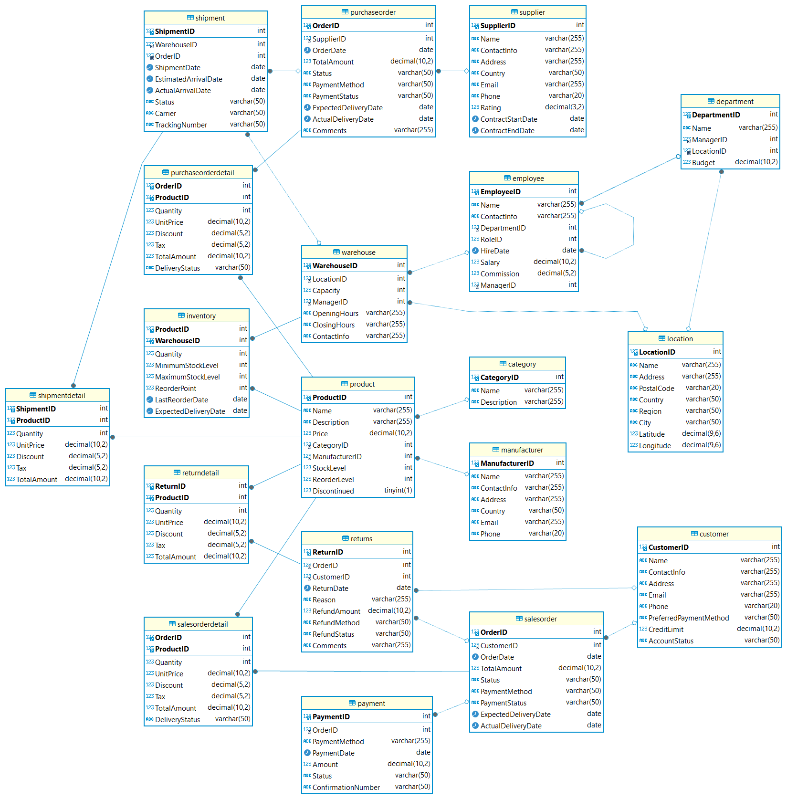
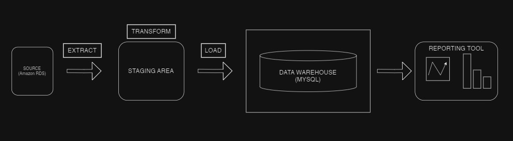

# eStore Data Warehouse and ETL Pipeline

This project implements a comprehensive **data warehouse** solution for **eStore**, an e-commerce platform, aimed at optimizing inventory management, sales analysis, and supplier relationships. The system uses an **ETL pipeline** to extract data from the company’s **Amazon RDS** database, perform data transformation (cleaning, deduplication, and structuring in a **star schema**), and load the processed data into a local **MySQL** database.

The transformed data is then made accessible to business users via **Power BI** for dynamic **reporting** and **dashboard creation**, enabling effective decision-making. This solution helps streamline operations, improve data quality, and provides actionable insights into inventory levels, sales performance, and market trends.

## OLTP Database ERD:


## Key Components:

### **ETL Pipeline**
- **Extract**: Data is extracted from Amazon RDS, which stores transactional data. All tables in the public schema are fetched and saved in **CSV format** for further processing.
- **Transform**: The data is cleaned and transformed, including handling missing values, removing duplicates, and creating a **star schema** for optimized analysis.
- **Load**: The transformed data is loaded into a **MySQL** database. This process involves reading CSV files, creating tables (if they don't exist), and inserting data into the database.

### **Data Warehouse Structure**
- The data is modeled using a **star schema**, which organizes data into **fact tables** (e.g., sales, inventory movements) and **dimension tables** (e.g., products, customers, time). This structure is ideal for high-performance queries and analytics.

### **Reporting & Analytics**
- The **MySQL** database is connected to **Power BI** using the MySQL connector. This integration allows business users to create dynamic **dashboards** and **visualizations** that provide insights into key business metrics, such as:
  - Inventory levels and stockouts across warehouses.
  - Sales performance over time and across different product categories.
  - Supplier performance and product demand forecasting.



## Features:
- **Data Extraction**: Automated extraction of data from Amazon RDS.
- **Data Transformation**: Cleansed and structured data using a star schema.
- **Data Loading**: Efficiently loads data into MySQL for optimized querying.
- **Power BI Integration**: Allows the creation of interactive dashboards and reports.

## Benefits:
- Optimized inventory management, reducing stockouts and overstocking.
- Enhanced sales analysis and forecasting based on historical data.
- Streamlined reporting and decision-making through dynamic dashboards.

## Getting Started:

1. Clone the repository:
   ```bash
   git clone https://github.com/yourusername/estore-etl-pipeline.git
   
2. provide your **Amazon RDS** and **MySQL connection strings** in the `etl-pipeline.py` file. This is essential for connecting to the respective databases for data extraction and loading.

